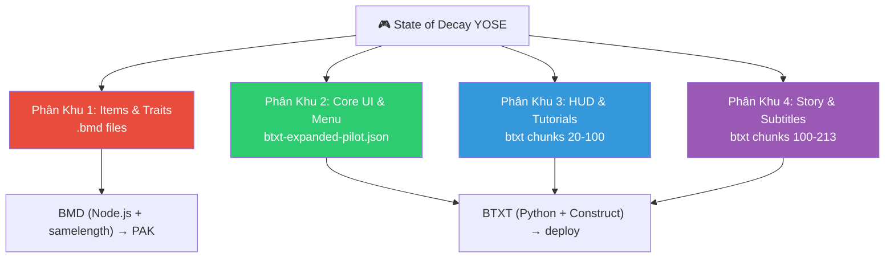

# Kế Hoạch Thực Thi Dự Án Việt Hóa Game v2 (Clean Architecture)

## Bối Cảnh

Dự án **Viethoa-game-v2** là phiên bản "chuyển sinh" của dự án Việt hóa game **State of Decay: Year One Survival Edition (YOSE)**. Toàn bộ tài sản quý giá từ dự án cũ đã được cứu hộ thành công:

| Tài sản | Trạng thái | Chi tiết |
|---------|-----------|----------|
| **Database dịch thuật** | ✅ 100% (13,692 entries) | [master-translation-db.json](file:///c:/Workspace/Viethoa-game-v2/master-translation-db.json) |
| **Bộ công cụ nhị phân** | ✅ Đầy đủ | [tools/](file:///c:/Workspace/Viethoa-game-v2/tools) - 6 module (bmd, btxt, pak, fonts, db, lib) |
| **Scripts triển khai** | ✅ Đầy đủ | [scripts/](file:///c:/Workspace/Viethoa-game-v2/scripts) - sync, utils |
| **Nhật ký kiến trúc** | ✅ 903 dòng | [LOCALIZATION_DECISION_LOG.md](file:///c:/Workspace/Viethoa-game-v2/LOCALIZATION_DECISION_LOG.md) |
| **Package config** | ✅ 81 scripts | [package.json](file:///c:/Workspace/Viethoa-game-v2/package.json) |

### Tình Trạng Files Trong Dự Án Hiện Tại

Như sếp đã gửi ảnh phân tích file `Salvage_Project.zip`, dự án hiện tại cực kỳ tinh gọn và chỉ bao gồm các thành phần cốt lõi:
- `scripts/` (các lệnh bash/ps1 tiện ích)
- `tools/` (bộ máy parse nhị phân)
- `LOCALIZATION_DECISION_LOG.md` (nhật ký)
- `master-translation-db.json` (dữ liệu dịch)
- `package.json` (cấu hình npm)

**Những thứ cố tình không mang sang V2 (Đã bị loại bỏ):**
- Thư mục `dashboard/` (Đã ngừng sử dụng dashboard web để tránh tốn phí API, chuyển sang dịch tay trong chat).
- Thư mục `output/` cũ chứa các file lỗi.

**Những thứ cần được tái tạo lại (Sẽ làm ở Giai Đoạn 0):**
- `input/` và `output/` (Thư mục làm việc mới)
- `config/` (Chứa các cấu hình dịch)
- `node_modules/` và `.env`

---

## Phân Tích 4 Phân Khu Việt Hóa

Dựa trên [PLAN_CLASSIFICATION.md](file:///c:/Workspace/Viethoa-game-v2/scripts/PLAN_CLASSIFICATION.md), dự án chia thành 4 khu vực độc lập:



---

## Kế Hoạch Thực Thi (6 Giai Đoạn)

### 🔧 Giai Đoạn 0: Thiết Lập Nền Tảng (Foundation Setup)

> [!IMPORTANT]
> Phải hoàn thành giai đoạn này trước khi làm bất cứ điều gì khác.

#### Bước 0.1: Verify Game Files trên Steam
- Do Steam của sếp đang dùng Tiếng Việt, sếp làm theo các bước sau:
- **Click chuột phải** vào tên game **State of Decay: Year-One** trong danh sách
- Chọn **Thiết lập...** (dòng dưới cùng)
- Ở cột bên trái, chọn **Tệp đã cài đặt** (hoặc Tệp trên máy)
- Bấm vào nút **Kiểm tra tính toàn vẹn của tệp trò chơi**
- Đợi Steam quét và tải lại các file gốc sạch 100%
- Xác nhận đường dẫn game: `D:\SteamLibrary\steamapps\common\State of Decay YOSE\Game`

#### Bước 0.2: Cài đặt Dependencies
```powershell
cd c:\Workspace\Viethoa-game-v2
npm install
```

#### Bước 0.3: Tạo file `.env`
```env
SOD_GAME_ROOT=D:\SteamLibrary\steamapps\common\State of Decay YOSE\Game
MONGODB_URI=mongodb://localhost:27017
MONGODB_DB=viethoa_sod
```

#### Bước 0.4: Trích xuất file gốc từ `gamedata.pak`
```powershell
npm run extract          # Trích xuất XML/BMD vào input/
npm run extract:runtime  # Bao gồm cả BTXT
```
- Kết quả: Thư mục `input/` chứa đầy đủ file gốc tiếng Anh

#### Bước 0.5: Tạo thư mục cấu hình
- Tạo `config/btxt-expanded-pilot.json` - manifest cho BTXT pilot strings
- Nạp lại abbreviation table từ [abbrev-table.json](file:///c:/Workspace/Viethoa-game-v2/scripts/abbrev-table.json)

#### Bước 0.6: Import Database dịch thuật vào MongoDB
```powershell
npm run db:migrate  # Nạp master-translation-db.json vào MongoDB
npm run db:stats    # Xác nhận 13,692 entries
```

---

### 📊 Giai Đoạn 0.7: Xây Dựng Dashboard UI Thống Kê & Quản Lý Dịch Thuật

**Mục tiêu:** Tạo một giao diện Web UI trực quan (chạy local) kết nối với MongoDB để dễ dàng theo dõi tiến độ.

#### Bước 0.7.1: Khởi tạo Project Dashboard
- Xây dựng giao diện bằng Vanilla HTML/JS + CSS (sử dụng thiết kế hiện đại, màu sắc ấn tượng, dynamic animation).
- Thiết lập Backend server nhẹ (Node.js/Express) để gọi API từ MongoDB nội bộ.

#### Bước 0.7.2: Chức Năng UI
- Dashboard tổng quan hiển thị tiến độ % dịch của từng phân khu (Zone).
- Hiển thị danh sách các câu thoại/văn bản: Text gốc, Text dịch hiện tại, Vị trí (Location), và **Phương án Build** (`[BTXT (Python)]` hoặc `[BMD (Node.js)]`).
- Cho phép tìm kiếm và xem trạng thái.

---

### 🏠 Giai Đoạn 1: Khôi Phục Menu & Core UI (Phân Khu 2)

**Mục tiêu:** Menu chính hiển thị tiếng Việt có dấu, game boot ổn định.

#### Bước 1.1: Build BTXT mở rộng cho menu (Bằng Python)
- Sử dụng parser lõi Python + Construct (`build_btxt_expanded.py`) cho phép tự do độ dài bản dịch.
```powershell
npm run build-btxt:expanded-pilot:dry   # Dry-run kiểm tra (Gọi Python)
npm run build-btxt:expanded-pilot       # Build thật (Gọi Python)
```

#### Bước 1.2: Patch Font Cluster A (Front-end menu fonts)
```powershell
npm run patch-cluster-a    # Nhồi glyph Arial vào class3_frontend.gfx
npm run build-font-swf     # Build HUD_Font_LocFont.swf
npm run build-ui-aliases   # Build alias SWF files
```

#### Bước 1.3: Deploy & Smoke Test
```powershell
npm run deploy-btxt:expanded-pilot      # Deploy BTXT
npm run sync-font-cluster-a             # Deploy Font Cluster A
```
- **Kiểm tra:** Khởi động game → Menu hiển thị tiếng Việt có dấu
- **Rollback:** Nếu crash, khôi phục từ backup tự động

---

### ⚔️ Giai Đoạn 2: Khôi Phục Items & Gameplay Text (Phân Khu 1)

**Mục tiêu:** Tên vũ khí, vật phẩm, kỹ năng hiển thị tiếng Việt.

#### Bước 2.1: Build BMD dịch thuật (Bằng Node.js)
- Do BMD sử dụng cấu trúc nhị phân độc quyền (DMBU), phân khu này bắt buộc dùng script Node.js.
```powershell
npm run build-bmd                # Build BMD từ DB dịch thuật
npm run build-bmd:samelength     # Ép cùng độ dài byte (chống crash)
```

#### Bước 2.2: Patch Font Cluster B + C (In-game fonts)
```powershell
npm run patch-cluster-b    # class3_pause.gfx
npm run patch-cluster-c    # class3_journal.gfx, class3_stats.gfx
npm run patch-cluster-d    # Các GFX khác
```

#### Bước 2.3: Đóng gói PAK & Deploy
```powershell
npm run pak:bmd-fonts          # Build PAK với BMD + Font patches
npm run pak:bmd-fonts:apply    # Apply vào game
```
- **Kiểm tra:** Vào game → Kiểm tra hòm đồ, bảng kỹ năng, tên nhân vật
- **Lưu ý:** Giữ nguyên BTXT + Cluster A từ Giai đoạn 1

---

### 📖 Giai Đoạn 3: Mở Rộng HUD & Tutorial Text (Phân Khu 3)

**Mục tiêu:** Các hướng dẫn, tooltip, HUD labels hiển thị tiếng Việt.

#### Bước 3.1: Dịch manual các BTXT chunks 20-100
- Sử dụng quy trình [Manual Translation Workflow](file:///c:/Workspace/Viethoa-game-v2/scripts/MANUAL_TRANSLATION_WORKFLOW.md)
- AI đọc từng chunk → Dịch → Ghi vào manifest

#### Bước 3.2: Merge manifests
```powershell
# merge-btxt-manifests.js gộp Khu 2 + Khu 3
# Khu 2 (Menu) luôn được ưu tiên nạp trước → không bao giờ bị ghi đè
```

#### Bước 3.3: Build & Deploy
```powershell
npm run build-btxt:expanded-pilot:workflow
npm run deploy-btxt:expanded-pilot
```

---

### 🎬 Giai Đoạn 4: Cốt Truyện & Phụ Đề (Phân Khu 4)

**Mục tiêu:** Lời thoại, nhiệm vụ, radio calls hiển thị tiếng Việt.

#### Bước 4.1: Dịch manual các BTXT chunks 100-213
- Lượng text khổng lồ, chia nhỏ dần
- Kiểm tra placeholder `{0}`, `%1$s` không bị mất

#### Bước 4.2: Merge + Build + Deploy
- Quy trình giống Giai đoạn 3
- Khu 2 (Menu) vẫn bất khả xâm phạm

---

### 🎨 Giai Đoạn 5: Polish & Quality Assurance

#### 5.1: Rà soát chuỗi bị truncate
```powershell
node scripts/utils/find-oversize-strings.js
```
- Dùng abbreviation table để rút gọn chuỗi quá dài
- Áp dụng autofix nếu có

#### 5.2: Font audit toàn diện
```powershell
npm run font-audit
npm run scan-font-usage
```
- Đảm bảo không còn surface nào hiển thị ô vuông

#### 5.3: Full playthrough test
- Chơi qua base game + Breakdown + Lifeline
- Ghi nhận mọi text còn sót tiếng Anh hoặc hiển thị lỗi

---

## Quy Tắc Vàng (Từ Decision Log)

> [!CAUTION]
> Các quy tắc sau đã được đúc kết từ hàng chục lần crash/rollback. **KHÔNG BAO GIỜ** vi phạm!

| # | Quy tắc | Lý do |
|---|---------|-------|
| 1 | BTXT (Python) được dịch dài/ngắn tùy ý | Core Parser Python tự tính toán lại offset an toàn |
| 2 | BMD (Node.js) phải cùng độ dài byte (same-length) | Variable-length BMD crash runtime (Lỗi cấu trúc DMBU) |
| 3 | Mỗi lần test chỉ thay đổi 1 cluster | Tránh debug mù khi crash |
| 4 | Không deploy khi `StateOfDecay.exe` đang chạy | File lock gây corrupt |
| 5 | Luôn backup trước deploy | Rollback nhanh |
| 6 | Không dịch biến hệ thống (PascalCase, snake_case, file paths) | Crash 0xc0000005 |
| 7 | Font device-name phải cùng độ dài (`Decaying Kuntry` → `Times New Roman`) | Tránh shift binary offset |
| 8 | Khu 2 (Menu) là Bất Khả Xâm Phạm trong merge | Tránh mất menu đã ổn định |

---

---

## Lộ Trình Triển Khai (Đã Xác Nhận)

1. **Khởi đầu:** Game gốc đã được Verify sạch sẽ (`D:\SteamLibrary\steamapps\common\State of Decay YOSE\Game`).
2. **Database:** MongoDB đang chạy ổn định.
3. **Thứ tự thực thi:** Sẽ đi tuần tự từ **Giai Đoạn 0** -> **Giai Đoạn 1** -> **Giai Đoạn 2**.
4. **Trạng thái file:** `Salvage_Project.zip` đã được giải nén đúng cấu trúc, không thiếu sót file quan trọng nào. Mọi rác từ V1 đã bị bỏ lại.

*(Sếp bấm **Proceed** để em bắt đầu chạy Giai Đoạn 0 nhé!)*

## Verification Plan

### Automated Tests
- `npm run build-btxt:expanded-pilot:dry` — Dry-run BTXT, kiểm tra không lỗi
- `npm run build-bmd:samelength:dry` — Dry-run BMD same-length
- `npm run font-audit` — Audit toàn bộ font usage
- `npm run db:stats` — Xác nhận database entries

### Manual Verification
- Khởi động game sau mỗi giai đoạn deploy
- Kiểm tra menu, HUD, inventory, dialogue từng giai đoạn
- Screenshot/ghi nhận mọi text bất thường
